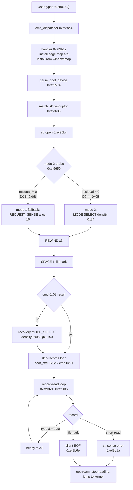
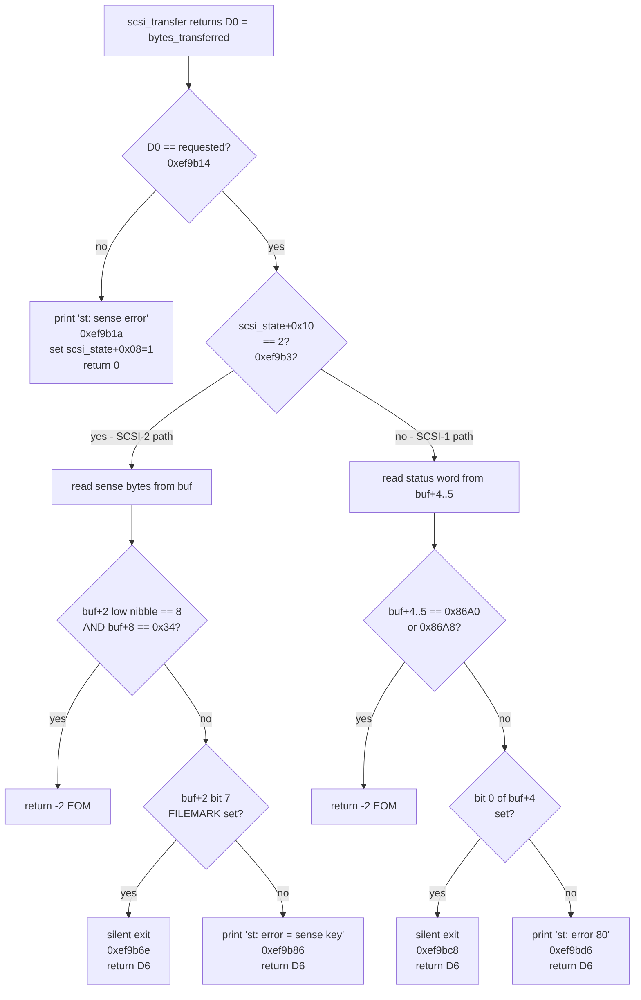
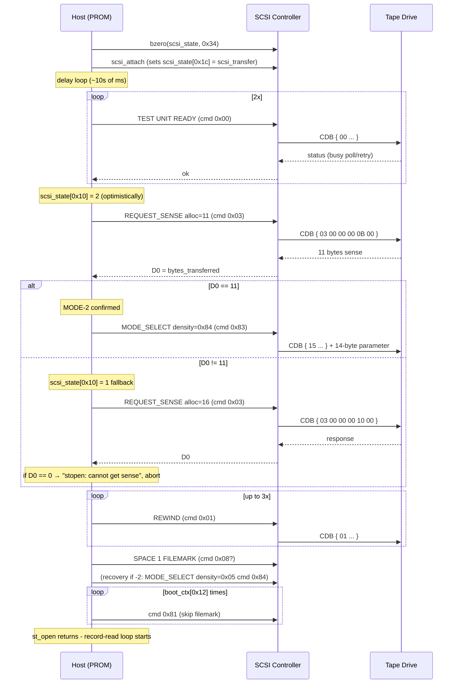
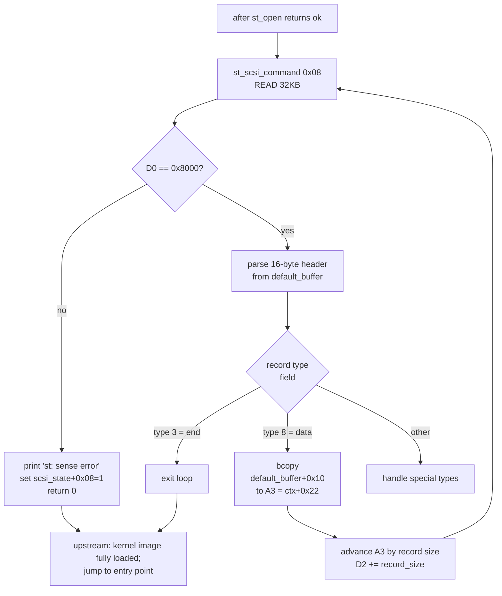

# Sun-2 PROM ↔ SCSI Tape Controller Reference

**Scope:** how the Sun-2/120 boot PROM (rev 10F, "multi" image) talks to the
on-board SCSI controller during a tape boot (`b st(0,0,4)`), what each command
in the PROM's tape driver does, what bytes go on the wire, what bytes the PROM
expects back, how the PROM interprets the controller's DMA-count register, and
why the operator sees `st: sense error` and `st: error 80` even on a successful
boot.

This document is written from the PROM's point of view, derived entirely from
disassembly of the rev-10F image (`merged_rom_10f.bin`). Address references in
the tables and snippets all point into that image.

---

## 1. Intro

The Sun-2/120 PROM treats the tape drive as a SCSI target sitting behind the
on-board Sun-2 SCSI controller. Tape boot is initiated by the user typing

```
b st(0,0,4)
```

at the monitor prompt. The PROM's command dispatcher takes this through the
boot-2 path (see `cmd_dispatcher` at `0xef3aa4`, handler at `0xef3b12`),
installs a fixed page map (`page_map_table_a` or `_b`), then calls
`parse_boot_device` which, after matching `"st"` against the device-descriptor
table at `0xefc680`, invokes `st_open` (`0xef95bc`). `st_open` brings the drive
up, decides whether to talk SCSI-1 or SCSI-2 based on a residual-count probe,
and hands control to the record-read loop that issues `READ(6)` repeatedly,
strips a 16-byte tape-record header, and `bcopy`s the body to the kernel
image's destination address.

The PROM's tape driver is small (~1 KB of 68010 code starting at `0xef95bc`)
and intentionally minimal:

- Only 11 distinct command codes (the PROM's internal `cmd_op`, not always
  identical to the SCSI opcode it puts on the wire).
- No demand paging or page-fault recovery — every fault is fatal.
- A single 16-bit DMA byte counter on the controller is the **only** signal
  channel the PROM uses to detect short reads, file marks, and end-of-medium.

The driver is therefore extremely sensitive to how the SCSI controller
reports residual counts. Two of the three on-screen `st:` messages are
direct consequences of that fact and are explained later in this document.

---

## 2. Big Picture



---

## 3. Bus / Address Layout

The PROM doesn't talk to the SCSI registers directly from the tape driver —
it goes through `scsi_state` (a 0x34-byte struct attached to `boot_ctx`)
and an indirect `scsi_state[0x1c]` function pointer that points at
`scsi_transfer` (`0xef8eae`). `scsi_transfer` is the only routine in the
PROM that actually reads/writes the on-board controller's MMIO registers.

Key shared structures:

| Structure | Where it lives | Layout used |
|-----------|---------------|------|
| `boot_ctx` | RAM `0x544` (resolved via `*(0xef000c) → 0xef00e4 → 0x544`) | see §5 |
| `scsi_state` | `boot_ctx[0x06]` (pointer-to) | see §5 |
| Default DMA buffer | `boot_ctx[0x32]` (computed at runtime, e.g. `0xbc000`) | first 16 bytes are a **tape-record header**, body starts at `+0x10` |
| Tape device descriptor | `0xefd608` | see §6 |

All MMIO addresses for the SCSI controller come from
`scsi_state[0x0c]` — the PROM tape driver never hardcodes them.

---

## 4. The Three On-Screen Messages

All three messages come from the **same function** (`st_scsi_command` at
`0xef97da`) on the post-transfer path. They are NOT independent error
classes — they are three different framings of "stop reading", chosen by
which transfer outcome occurred.



| Message | Print site | Triggered by |
|---------|-----------|--------------|
| `st: sense error` | `0xef9b1a` | `bytes_transferred != requested_bytes` (any short read) |
| `st: error = %x sense key = %x` | `0xef9b86` | mode 2 + full count + sense byte 2 with FILEMARK bit clear |
| `st: error %x` | `0xef9bd6` | mode 1 + full count + status word at `buf[+4..5]` matches no sentinel and bit 0 clear |

For a Sun-2 emulator running an unmodified Sun-2 PROM and a stock SCSI-1
or SCSI-2 tape device, **`st: sense error` is the normal end-of-file
indication for the kernel-record-read loop**. The boot proceeds.

`st: error 80` is **not the same condition** as `st: sense error`.
Understanding what triggers it requires three concepts that the rest
of this document also relies on — let's define them properly.

#### What is "mode 1" vs "mode 2"?

When the PROM opens the tape drive at boot, `st_open` runs a
**probe** to figure out what kind of SCSI sense format the drive
speaks (this whole probe is the topic of §10). The result is stored
in `scsi_state[0x10]` and is one of two values:

- **mode 2** — the drive speaks **SCSI-2 fixed-format extended sense**
  (response code 0x70 / 0xF0, 8+ bytes, sense key in byte 2 low
  nibble, FILEMARK bit at byte 2 bit 7, ASC at byte 12 / 8-depending-on-version).
  The PROM's later code paths know how to interpret this layout.
- **mode 1** — the drive speaks **SCSI-1 non-extended sense** (just
  4 bytes: byte 0 = error class+code+ADV, bytes 1..3 = LBA). This is
  the original 1986 SCSI-1 sense format.

The PROM picks **mode 2 if and only if** the SCSI controller reports
that exactly 11 bytes were transferred during the probe REQUEST_SENSE
(see §10.2). Anything else — including the "controller never updated
its DMA-count register" failure mode that many emulators trigger —
falls through to mode 1.

Once `scsi_state[0x10]` is set, every subsequent SCSI command that
returns CHECK CONDITION-with-data is decoded through that same mode's
interpretation rules. The drive doesn't change its actual SCSI-2
extended-sense response — only the PROM's *interpretation* of those
bytes changes.

#### What is the "mode-1 status decode"?

When a SCSI command returns successfully (full byte count transferred,
not a short read), the PROM still has to look at the response data to
decide whether the operation **logically** succeeded. The mode-1 status
decoder is the chunk of code at `0xef9b96..0xef9bd6` that runs when:

1. the transfer was full-count (no short read), AND
2. `scsi_state[0x10]` is **NOT** 2 (i.e., we're in mode 1).

The decoder reads a **16-bit word at `default_buffer[+4..+5]`** — bytes
4 and 5 of whatever the drive just returned via DMA — and treats those
two bytes as a Sun-2-specific "completion status word". This is **not**
a SCSI-standard concept; it's a Sun-2 PROM convention from the days
when SCSI-1 drives often returned a small status header at the start
of the data buffer, separate from the formal 4-byte sense response.

The decoder doesn't try to understand the data field by field. It does
exactly three checks, in order:

```
if  (word == 0x86A0) → "EOM sentinel #1"     → return -2 (caller treats as end-of-medium)
if  (word == 0x86A8) → "EOM sentinel #2"     → return -2 (same as above)
if  (bit 0 of high byte set) → "OK silent"   → return D6 silently (no message)
otherwise → print "st: error %x" with the raw word value
```

#### What is a "sentinel" here?

A **sentinel** in this context is a magic constant value that the PROM
recognises as having a special meaning, distinct from "real data". The
two values `0x86A0` and `0x86A8` are exactly such sentinels — the
PROM's tape driver was hand-coded to recognise them as "end-of-medium"
indicators (probably from a specific 1980s SCSI-1 tape drive that
returned those codes in its status header). They're hard-coded as
immediate operands in the PROM at `0xef9ba6` and `0xef9bb2`:

```
00ef9ba6: 0c 68 86 a0 00 04   cmpi.w  #0x86A0, (0x4,A0)   ; sentinel #1
00ef9bb2: 0c 68 86 a8 00 04   cmpi.w  #0x86A8, (0x4,A0)   ; sentinel #2
```

Any value other than these two — and where bit 0 of the high byte
isn't set as an "OK" flag — is treated as "I don't know what this is,
print it for the human":

```
00ef9bd0: 30 28 00 04         move.w  (0x4,A0), D0w        ; D0 = the unrecognised word
00ef9bd6: 48 79 00 ef d6 a3   pea     s_st_error_status_word ; "st: error %x\n"
00ef9bdc: 61 00 ...           bsr.w   WritePEAtoDisplay
```

#### Putting it together — why `st: error 80`

For the operator to see `st: error 80` on screen, **all four** of these
must be true:

1. The mode-2 promotion gate at `0xef9650` failed during `st_open`, so
   `scsi_state[0x10]` is **1** (mode 1) for the rest of the boot.
2. A subsequent SCSI command (typically a READ during the kernel-image
   load loop) **succeeded** with the full requested byte count. So
   we're on the full-count path at `0xef9b32`, NOT the short-read path
   that prints `st: sense error`.
3. The byte at `default_buffer[+4]` is `0x00` (high byte of the status
   word, and bit 0 is clear so it's not an "OK silent" exit).
4. The byte at `default_buffer[+5]` is `0x80` (low byte of the status
   word). The combined word is `0x0080`, which is neither `0x86A0` nor
   `0x86A8` — so it isn't a sentinel.

The resulting word `0x0080` typically arrives because the drive
returned a **SCSI-1-style 4-byte sense header** with the **ADV
(address-valid) bit set** and no actual error class/code:

```
SCSI-1 short-form sense byte 0 = 0x80:
   bit 7 (ADV)     = 1    → "the LBA in bytes 1..3 is meaningful"
   bits 6..4 (EC)  = 0    → no error class
   bits 3..0 (ERR) = 0    → no error code
```

Read as a Sun-2 status word, that becomes `0x0080` (high byte of the
word = `0x00` because the status word is read at offset +4..+5, not
+0..+1). The PROM's mode-1 decoder doesn't recognise it as a sentinel
or as the OK pattern, so it prints the raw value.

The boot still proceeds. `st: error = sense key` is the **SCSI-2
cousin** of the same situation: same "didn't recognise the
post-success status" failure mode, but on the mode-2 sense-decode
path at `0xef9b3c..0xef9b86`, where the decoder reads sense byte 2 +
sense byte 8 and prints both formatted instead of a single status
word.

---

## 5. Key Data Structures

### 5.1 `boot_ctx` (boot context)

`boot_ctx` is a fixed RAM struct. The PROM finds it through a double
indirection out of the vector table: `*(0xef000c) = 0xef00e4`, and
`*(0xef00e4) = 0x00000544`. So `boot_ctx` lives at RAM `0x544`.

| Offset | Width | Field | Set by | Purpose |
|--------|-------|-------|--------|---------|
| `+0x06` | u32 | `scsi_state*` | `scsi_attach` | pointer to the SCSI driver state struct |
| `+0x0e` | u32 | unit/lun decoded | `parse_boot_device` | upper bits = unit (LUN), low 3 bits = target |
| `+0x12` | u32 | skip-record count | upstream | number of `cmd 0x81` to issue at end of `st_open` |
| `+0x22` | u32 | `user_buffer` | `st_open` (= `boot_ctx[0x32]`) | DMA target address for current command |
| `+0x26` | u32 | `transfer_length` | each cmd setup | bytes (or blocks if FIXED) requested |
| `+0x32` | u32 | `default_buffer` | upstream | base of the DMA scratch area, with a 16-byte header preceding the body |
| `+0x86` | u32 | probe result | `parse_boot_device` | unit number / -1 |
| `+0x8a` | u32 | controller | parsed from cmdline | `b st(ctlr, ...)` |
| `+0x8e` | u32 | partition | parsed from cmdline | |
| `+0x96` | u32 | dev descriptor ptr | `parse_boot_device` | back-pointer to the matched device descriptor |

### 5.2 `scsi_state` (driver state)

| Offset | Width | Field | Description |
|--------|-------|-------|-------------|
| `+0x00` | u32 | target bit | `1 << (target & 7)` |
| `+0x04` | u32 | target id | low 3 bits |
| `+0x08` | u32 | EOF/error sticky flag | set to 1 on any non-OK exit; cleared by upstream when starting a new command sequence |
| `+0x0c` | u32 | controller MMIO base | pointer to register block |
| `+0x10` | u32 | sense format mode | **1** = SCSI-1 short-form, **2** = SCSI-2 extended |
| `+0x14` | u32 | requested transfer count | written by per-cmd handler |
| `+0x16` | u16 | DMA count (low word) | overlaps `[0x14..0x17]`; `scsi_transfer` reads here |
| `+0x18` | u32 | DMA address | physical address for data phase |
| `+0x1c` | fnptr | transfer function | set to `scsi_transfer` by `scsi_attach` |

The overlap between `[0x14]` (long) and `[0x16]` (word) is intentional:
the per-cmd handler stores the transfer count as a long; `scsi_transfer`
reads only the lower 16 bits as the DMA count to push to the controller.

### 5.3 Tape device descriptor (`0xefd608`)

| Offset | Width | Field | Value at 0xefd608 | Notes |
|--------|-------|-------|-------------------|-------|
| `+0x00` | str | name | `"st"` | device name |
| `+0x02` | fnptr | probe | `0xef7a40` | generic boot-device probe |
| `+0x06` | fnptr | strategy/secondary | `0xef7cc8` | |
| `+0x0a` | fnptr | open | `0xef95bc` | `st_open` |
| `+0x0e` | fnptr | read | `0xef9760` | |
| `+0x12` | fnptr | close | `0xef979a` | |
| `+0x16` | strptr | name string | `"st: SCSI tape"` | shown by monitor |
| `+0x1a` | u32 | misc | `0xefd5ec` | |

---

## 6. PROM Command Codes ("cmd_op")

The PROM tape driver has its own **internal** command-code namespace.
For most values the cmd_op equals the SCSI opcode it stores in CDB[0],
but for three values (0x81, 0x83, 0x84) the cmd_op is purely internal
and gets rewritten before going on the wire.

| cmd_op | SCSI opcode emitted | Handler @ | Description |
|--------|---------------------|-----------|-------------|
| `0x00` | `0x00` TEST UNIT READY | `0xef9948` | clear CDB[4]; busy-poll loop with retry |
| `0x01` | `0x01` REWIND | `0xef9948` | shared with TUR |
| `0x03` | `0x03` REQUEST_SENSE | `0xef9950` | DMA to user_buffer, length from `boot_ctx[0x26]`, CDB[4] = alloc length |
| `0x08` | `0x08` READ(6) | `0xef9968` | round len up to 512, build 24-bit block-count CDB; sets FIXED bit in mode 2 |
| `0x0a` | `0x0a` WRITE(6) | `0xef9968` | shared with READ(6) |
| `0x10` | `0x10` WRITE FILEMARKS | `0xef993e` | CDB[4] = 1 |
| `0x15` | `0x15` (used by MODE-SELECT data builder) | `0xef98e8` | shared body |
| `0x1b` | `0x1b` LOAD/UNLOAD | `0xef9948` | shared with TUR |
| **`0x81`** | **`0x11` SPACE** | `0xef992c` | rewrites CDB[0]→0x11, CDB[1]\|=1 (filemarks), CDB[4]=1 |
| **`0x83`** | **`0x15` MODE SELECT(6)** in mode 2; `0x0d` vendor in mode 1 | `0xef9896` | density code 0x84 |
| **`0x84`** | **`0x15` MODE SELECT(6)** in mode 2; `0x0d` vendor in mode 1 | `0xef98c0` | density code 0x05 (QIC-150) |

The dispatcher itself is a sorted-table search at `0xef9866..0xef987c`,
backed by:

- the value table at `0xef99e2`: `84 83 81 1b 15 10 0a 08 03 01 00`
  (sorted descending, indexed via `dbcc` from 10 to 0).
- the offset table at `0xef9880`:
  `00C8 00C8 00D0 00E8 00E8 00BE 0068 00C8 00AC 0016 0040`
  (16-bit offsets added to base `0xef9880`).

---

## 7. CDB Construction

Every command starts with the same 6-byte boilerplate at `0xef9824`:

```
bzero(local_cdb, 6)
local_cdb[0] = cmd_op                            ; CDB[0] = SCSI opcode
local_cdb[1] = (target & 7) << 5                 ; lun in old SCSI-1 style
```

Then the per-cmd handler (§6) fills in further bytes. After the handler,
control falls into the common transfer path at `0xef99ee`.

The CDB layout the PROM emits is the SCSI-1 group-0 6-byte form:

```
+--------+--------+--------+--------+--------+--------+
| CDB[0] | CDB[1] | CDB[2] | CDB[3] | CDB[4] | CDB[5] |
+--------+--------+--------+--------+--------+--------+
   opcode    LUN/    24-bit   block /  alloc /  control
            FIXED   block-count high   count    byte (0)
                    /flags    middle   (low)
```

For READ(6)/WRITE(6) the count is in CDB[2..4] (24-bit big-endian). For
REQUEST_SENSE/INQUIRY the allocation length is in CDB[4] alone and
CDB[2..3] are zero. CDB[5] is always zero.

---

## 8. The DMA Count Register — Critical Detail

This single piece of behaviour drives **everything** the PROM does with
the tape driver's status messages. Read carefully.

### 8.1 Setup (in `scsi_transfer`)

Before the transfer:

```c
*(uint  *)(ctrl + 0x08) = scsi_state[0x18] & 0x000FFFFF; // DMA address
*(ushort*)(ctrl + 0x0C) = ~scsi_state[0x16];             // DMA count, NEGATED
```

So if the PROM asks for `N` bytes:

- `scsi_state[0x14]` (long) = `N`
- `scsi_state[0x16]` (low word, overlapping `[0x14]`) = `N`
- DMA-count register = `~N` = `-N - 1` (16-bit one's complement)

Example: `N = 11` (0x000B). DMA count register = `0xFFF4`.

### 8.2 Transfer

The controller is expected to **increment the DMA count register by one
for each byte transferred** during the data phase. After 11 bytes:

- DMA count register = `0xFFF4 + 11 = 0xFFFF`

### 8.3 Compute "bytes transferred" (in `scsi_transfer` return)

```c
return *(int   *)(ctrl_ + 0x14) - (uint)(ushort)~*(ushort*)(ctrl + 0x0C);
//      ^^^^^^^^^^^^^^^^^^^^^^^^^^^   ^^^^^^^^^^^^^^^^^^^^^^^^^^^^^^^^^^^^^^^^^^^^^
//      requested count (= N)         residual bytes left in counter
```

After 11 bytes transferred:
- `~register` = `~0xFFFF` = `0x0000`
- residual = 0
- return = `11 - 0 = 11`  ✓

After 0 bytes transferred:
- `~register` = `~0xFFF4` = `0x000B` = 11
- return = `11 - 11 = 0`

After 6 bytes transferred:
- `~register` = `~0xFFFA` = `0x0005` = 5
- return = `11 - 5 = 6`

So the return value of `scsi_transfer` is **exactly the number of bytes
the controller's DMA counter says it transferred**, not a software
count of bytes the SCSI device handed over.

### 8.4 What this means for an emulator

If your SCSI controller emulation does any of these:

1. Skips updating the DMA count register because it copied data through
   a "back door" directly into the host memory buffer.
2. Sets the DMA count register to `requested_count` instead of letting
   it start at `~requested_count` and increment.
3. Updates the count register but stops at the **device's** transfer
   length instead of the **host's** allocation length (e.g. transfers
   a full 18-byte SCSI-2 sense response when the PROM asked for 11).

…then the PROM will see a wrong return value and:

- mis-detect short reads (cause #1, #2),
- fail the mode-2 promotion gate (cause #3),
- print `st: sense error` or `st: error 80` even on healthy reads.

---

## 9. `st_open` — the Drive-Bring-Up Sequence

Disassembled from `0xef95bc`. Step numbers correspond to the table
below the diagram.



| Step | PROM addr | Cmd | What happens |
|------|-----------|------|--------------|
| 1 | `0xef95cc..0xef95d6` | — | `bzero(scsi_state, 0x34)` |
| 2 | `0xef95dc..0xef95fa` | — | unit/lun extracted from `boot_ctx[0x0e]`, target written to `scsi_state[0x04]` |
| 3 | `0xef95fe..0xef9604` | — | `scsi_attach` sets `scsi_state[0x1c] = scsi_transfer` |
| 4 | `0xef960e..0xef961e` | — | software delay loop, ~`0x09896800 / 2^N` cycles where N = `*(0xefb108).l` |
| 5 | `0xef9620..0xef9632` | `0x00` | TEST UNIT READY × 2 |
| 6 | `0xef9634..0xef9650` | `0x03` | mode-2 probe: pre-set mode = 2, REQUEST_SENSE alloc = 11 |
| 6.gate | `0xef9650..0xef9652` | — | `cmp.l D7,D0` (D7=11). beq → mode 2; else fallback |
| 7a (mode 2) | `0xef9688..0xef96ac` | `0x83` | MODE_SELECT(6) density 0x84, 13 bytes |
| 7b (mode 1) | `0xef9654..0xef9684` | `0x03` | REQUEST_SENSE alloc 16; if 0 → fail with `stopen: cannot get sense` |
| 8 | `0xef96b0..0xef96e2` | `0x01` × up to 3 | REWIND/idle |
| 9 | `0xef96e8..0xef9700` | `0x08` | SPACE / READ FILEMARK with len 0x200 |
| 10 | `0xef9714..0xef9724` | `0x84` | recovery MODE_SELECT to density 0x05 (QIC-150) on -2 |
| 11 | `0xef9726..0xef973c` | `0x81` × `boot_ctx[0x12]` | skip records loop |
| 12 | `0xef973e` | — | rts to caller, which starts the kernel-record-read loop |

---

## 10. The Mode-2 Promotion Gate (THE Important Test)

This is the single most important conditional in the tape driver, and
the reason most emulators end up in mode 1.

### 10.1 The disassembly

```
00ef9634:  29 47 00 10            move.l  D7, (0x10,A4)        ; scsi_state[0x10] = 2 (optimistic)
00ef9638:  7e 0b                  moveq   #0x0B, D7              ; D7 = 11
00ef963a:  2b 47 00 26            move.l  D7, (0x26,A5)         ; boot_ctx[0x26] = 11 (alloc length)
00ef963e:  2b 6d 00 32 00 22      move.l  (0x32,A5), (0x22,A5)  ; user_buffer = default_buffer
00ef9644:  48 55                  pea     (A5)                   ; arg2 = boot_ctx
00ef9646:  48 78 00 03            pea     (3).w                  ; arg1 = 3 (REQUEST_SENSE)
00ef964a:  61 00 01 8e            bsr.w   st_scsi_command         ; D0 = bytes_transferred
00ef964e:  50 4f                  addq.w  #8, SP

;================ THE GATE ================
00ef9650:  b0 87                  cmp.l   D7, D0                ; D7=11, D0=return
00ef9652:  67 34                  beq.b   0xef9688              ; equal → MODE 2 stays
;==========================================

;-------- MODE-1 fallback --------
00ef9654:  7e 01                  moveq   #1, D7
00ef9656:  29 47 00 10            move.l  D7, (0x10,A4)         ; scsi_state[0x10] = 1
00ef965a:  7e 10                  moveq   #0x10, D7              ; D7 = 16
00ef965c:  2b 47 00 26            move.l  D7, (0x26,A5)         ; boot_ctx[0x26] = 16
00ef9660:  ...                    second REQUEST_SENSE
```

### 10.2 What the test actually checks

> Did the SCSI controller's DMA byte counter report exactly 11 bytes
> transferred during the REQUEST_SENSE data phase?

It does **NOT** check:

- any byte of the response data,
- the response code (byte 0),
- the additional-sense-length field (byte 7),
- the sense key,
- the FILEMARK bit,
- the INQUIRY response,
- the ANSI version,
- vendor strings.

### 10.3 What the PROM puts on the wire

```
Operation:    REQUEST_SENSE (mode-2 probe)
CDB:          03 (target<<5) 00 00 0B 00
Direction:    in (device → host)
Length:       11 bytes (alloc length in CDB[4])
DMA address:  boot_ctx[0x32]                    (default_buffer)
DMA count:    11   (registered as ~11 = 0xFFF4 in controller)
```

### 10.4 What the device must do for mode 2

The drive needs to put **exactly 11 bytes** through the data phase, and
the controller must tick its DMA counter once per byte. After completion:

- Controller DMA count register must be `0xFFFF` (= `0xFFF4 + 11`)
- `scsi_transfer` returns `11`
- `st_scsi_command(3)` returns `D6 = 11`
- `st_open` test `cmp.l D7, D0` evaluates equal → mode 2 confirmed

### 10.5 Common emulator failure modes

| Symptom | Likely cause |
|---------|--------------|
| Mode 1 always chosen | Controller doesn't tick DMA count register on transfer; counter stays at `0xFFF4`; return = 0 |
| Mode 1 always chosen | Device hands controller the **full** 18-byte SCSI-2 sense response instead of stopping at the 11-byte alloc length; counter overshoots; return is wrong |
| `stopen: cannot get sense` failure | Device returns 0 bytes for both the alloc=11 AND alloc=16 REQUEST_SENSE |
| `stopen: mode select failed` | Mode 2 confirmed, but MODE_SELECT(6) was rejected by device (CHECK CONDITION) |

The fix is **always** in the SCSI controller layer, not the SCSI device
layer. The device can return whatever fixed-format extended sense it
likes; what matters is the controller honouring the host's allocation
length and ticking the DMA count once per byte.

---

## 11. Record-Read Loop (post-`st_open`)

Once `st_open` returns, control flows into a record-processing loop that
issues `READ(6)` (cmd 0x08) repeatedly to copy the kernel image off the
tape.



The loop is at `0xef9824..0xef9bf6` (which is the body of `st_scsi_command`
itself — note that st_scsi_command does post-transfer dispatch on record
type via the secondary discriminator at `0xef9a5e`). Each iteration:

1. Issue `READ(6)` for `boot_ctx[0x26]` bytes (typically 0x8000 = 32 KB)
2. DMA target is `boot_ctx[0x32] + 0x10` — the body of the buffer, leaving
   16 bytes for a per-record header at `boot_ctx[0x32]`
3. After return, the upstream caller decodes the 16-byte header to find
   the record type (D7 in the loop body) and destination address (A3 from
   `boot_ctx[0x22]`)
4. For record type 8, `bcopy` from `default_buffer + 0x10` to `A3` (32KB)
5. Loop until short read → `st: sense error` → upstream stops

The `bcopy` site is `0xef9a86`, calling `copy_bytes` at `0xef6c12`.

---

## 12. The "st: error %x" Decoder Tree

Reference for the SCSI-1 (mode 1) status word at `buf[+4..+5]`:

| Word value | Meaning to PROM | Action |
|-----------|-----------------|--------|
| `0x86A0` | EOM-like sentinel #1 | return -2 |
| `0x86A8` | EOM-like sentinel #2 | return -2 |
| any value with `bit 0 of buf[+4]` set | "OK" silent flag | silent return |
| **any other value** | unknown — print | `st: error <word>` |

### 12.1 Why `st: error 80` specifically

For `st: error 80`:

- `buf[+4]` = `0x00` (not `0x86`, not `0x86`, bit 0 not set)
- `buf[+5]` = `0x80`
- Combined word = `0x0080`

The byte `0x80` at offset `+5` is **the first byte of a SCSI-1
non-extended sense response with the ADV (address-valid) bit set and
otherwise no error**:

```
SCSI-1 short-form sense byte 0:
   bit 7   = ADV (address valid)         <- 1
   bits 6:4 = error class                 <- 0
   bits 3:0 = error code                  <- 0
```

So the device is saying "I have a valid address pointer to give you,
no error class, no error code" — a perfectly normal sense response.
The PROM's mode-1 status decoder sees the `0x00 0x80` word, doesn't
recognise it as one of the EOM sentinels, doesn't see the OK flag in
bit 0 of the high byte, and prints the raw value.

The boot still proceeds. `st: error 80` is **noise**, not a fault.

### 12.2 Why the message even exists

The mode-1 status decoder was written for SCSI-1 drives that put a
2-byte command-completion status word at the start of the data buffer
(this is **not** standard SCSI — it's a Sun-2 convention). A SCSI-2
device returning extended sense never lands in this decoder if the
mode-2 promotion gate succeeded. The user only sees `st: error 80`
when:

1. The mode-2 promotion gate failed (controller residual issue), AND
2. A subsequent SCSI command returned a full-count transfer with a
   non-EOM, non-OK status word in bytes 4..5.

### 12.3 Quick reference — the decoder's interpretation of buf[+4..+5]

| What the device put in buf[+4..+5] | What the PROM does |
|-----------------------------------|--------------------|
| anything with bit 0 of buf[+4] = 1 | silent return (treat as OK) |
| `0x86A0` | return -2 (EOM) |
| `0x86A8` | return -2 (EOM) |
| `0x0080` | print `st: error 80` and continue |
| `0x0040` | print `st: error 40` and continue |
| `0x008x` (where x has bit 0 clear) | print `st: error 8x` and continue |
| anything else with bit 0 clear | print `st: error <word>` and continue |

---

## 13. Recipe: How to Make the Boot Silent

For an emulator targeting a clean Sun-2 boot with no `st:` messages on
screen, the **single thing that has to be right** is the SCSI
controller's DMA-count register handling for the mode-2 probe at
`0xef9650`. Specifically:

1. The host writes the negated allocation length (`~11 = 0xFFF4`) to
   the controller's DMA count register before the data phase.
2. The device returns sense data (any reasonable SCSI-2 fixed-format
   extended sense will work — the PROM doesn't read the bytes).
3. **The controller increments its DMA count register by 1 for each
   byte the device hands it during the data phase, stopping when it
   has transferred the host-allocated 11 bytes.**
4. After the transfer the count register reads `0xFFFF`.

When all four are true, `scsi_transfer` returns `11`, the gate at
`0xef9650` matches, mode-2 sticks, the FILEMARK silent-exit path is
used for EOF, and the boot is silent.

If you can't fix the controller, mode 1 is functionally fine — the
boot still completes — you just get the "noise" messages.

---

## 14. SunOS Install Media

This chapter explains what a SunOS distribution tape actually contains
for the Sun-2/Sun-3 platforms (specifically SunOS 3.2 and SunOS 3.5),
how the PROM tape commands documented above are used during a real
install, and how the install proceeds end-to-end.

It is **strictly** about the SunOS 3.x tape format. Don't confuse this
with the later SunOS 4.1.x layout (which Peter Koch's 1995 paper
describes for Sun-3): SunOS 4.x added an XDR table of contents
(`xdrtoc`), the `tpboot` + `munix` + `munixfs` separation, and the
`miniroot` as a UFS image. **None of those are present on a SunOS 3.x
tape.** SunOS 3.x uses BSD `dump` images for filesystems and `tar` for
package archives, with no on-tape index.

### 14.1 SunOS for Sun-2

| Release | Sun-2 support? | Tape format used | Notes |
|---------|---------------|------------------|-------|
| SunOS 1.1 | yes | dump + tar | smallest, fastest install on a 7 MB Sun-2/120 |
| SunOS 2.0 | yes | dump + tar | requires `dkbad` for the disk |
| SunOS 3.2 | yes | dump + tar | last "official" Sun-2 release; the focus of this chapter |
| SunOS 3.5 | yes (Sun-3 primary) | dump + tar | runs on Sun-2 with the right kernel; tape format is more standardized than 3.2 |
| SunOS 4.0.3 | yes (unofficial) | xdrtoc-style | will run; tape boot mostly works |
| SunOS 4.1.x | no (Sun-3 onwards) | xdrtoc-style | a-out format and library set are Sun-3-specific |

The `b st()` boot path in the rev-10F PROM (§9–§11) is the entry point
for all of these on a Sun-2. The PROM does **not** know anything about
a-out, BSD dump, tar, file systems, or tape file numbering — it just
reads records off a SCSI tape and lets the loaded program take over.

### 14.2 Tape format conventions

SunOS 3.x distribution tapes use exactly two formats, alternating:

#### BSD `dump` format

Used for **filesystems** that need to be restored as bootable, executable
trees. Specifically:

- the install miniroot
- the root filesystem (`/`)
- `/usr`
- `/usr/kvm` (when separate)

Properties:

- inode-based, preserves permissions, symlinks, device nodes, and
  ownership.
- Required for a bootable filesystem restore — `tar` cannot reproduce
  device nodes the same way.
- Recognised by `restore tf /dev/nrst0` (table-of-contents listing).
- Restored with `restore rf /dev/nrst0` (recursive file restore).

#### `tar` format

Used for **utility bundles** and **optional packages**:

- standalone tools (format, newfs, restore, tar binaries themselves)
- demos, games, documentation
- optional patches

Properties:

- POSIX `ustar` archive.
- Extracted with `tar xvf /dev/nrst0` (or `tar xvpf` to preserve
  permissions).
- Cannot fully reproduce a bootable Unix tree (loses some metadata).

#### What is NOT on the tape

- No ISO9660 / UFS filesystem structure on the tape itself.
- No partition table or label.
- No XDR table of contents (that's a SunOS 4.x feature).
- No compression (compressed-tar `tarZ` is also a 4.x feature).
- No labels between files beyond the SCSI tape EOF (filemark).

So the tape is just a sequence of files separated by filemarks, each
file being either a `dump` image or a `tar` archive.

### 14.3 SunOS 3.2 — Tape 1 (Boot / Miniroot / Install)

This is the tape required for `b st(0,0,0)` first boot.

| File # | Format | Content | Notes |
|--------|--------|---------|-------|
| **1** | raw | **boot block** (a-out of the tape bootstrap) | PROM loads this first via `b st()` |
| **2** | raw | **standalone kernel** (`vmunix` or `boot.sun2`/`boot.sun3`) | loaded into RAM by the boot block in file 1 |
| **3** | BSD dump | **miniroot filesystem** | mounted as `/` in RAM by the kernel from file 2 |
| **4** | tar | **standalone utilities** (format, newfs, restore, tar) | extracted as needed by the install scripts |
| **5** | tar (optional) | diagnostics / support tools | varies by media revision |

**Verifiable behaviour:**

- File 1 is purely a tape bootstrap. Its job is to read file 2.
- File 2 is the install kernel (no separate `munix`/`munixfs` split here
  the way SunOS 4.x has).
- File 3 is mounted as `/` after the kernel from file 2 boots — it's
  loaded into a RAM disk as the install root.
- `/etc/install`, `/etc/restore`, and `/dev/*` all live inside file 3.
- File 4 provides the additional tools (`format`, `newfs`, `tar`,
  `restore` binaries) the install scripts call out to.

### 14.4 SunOS 3.2 — Tape 2 (System Distribution)

This tape contains the actual operating system to be installed onto disk.

| File # | Format | Content | Notes |
|--------|--------|---------|-------|
| **1** | BSD dump | **`/` (root filesystem)** | restored with `restore rf` |
| **2** | BSD dump | **`/usr` filesystem** | largest component |
| **3** | BSD dump or tar | `/usr/kvm` or kernel-related files | depends on distribution variant |
| **4** | tar | optional software (games, demos) | not always present |
| **5+** | tar | additional optional components | varies |

**Critical:** root and `/usr` are **dump format, not tar**. To extract
them you must run:

```
restore rf /dev/nrst0
```

`tar xvf /dev/nrst0` will fail or produce garbage on these files.

### 14.5 SunOS 3.5 — same shape, more standardized

SunOS 3.5 follows the same two-tape, dump+tar layout but is more
consistent across Sun-3 systems. Key differences:

| Aspect | SunOS 3.2 | SunOS 3.5 |
|--------|-----------|-----------|
| Kernel naming | sometimes `boot.sun2` / `boot.sun3` | more standardized `vmunix` |
| Tape consistency | varies between media revisions | more uniform |
| `/usr/kvm` split | optional (sometimes part of `/usr`) | usually a separate file |
| Standalone utilities | less standardized | more complete set in file 4 |

Tape 1 file 3 (the miniroot) is the part you actually interact with.
Inside the dump, both 3.2 and 3.5 have the same essentials:

- `/etc/install`, `/etc/mount`, `/etc/restore`
- `/dev/nrst0`, `/dev/sd*` (so the miniroot can talk to tape and disk)
- `/stand/*` standalone tools (where present in 3.5)

### 14.6 The boot-from-tape pipeline (verified for both 3.2 and 3.5)

```mermaid
flowchart TD
    A["user types 'b st()'<br/>or 'b st(0,0,0)'"] --> B[PROM cmd_dispatcher cmd-2<br/>installs page maps]
    B --> C[parse_boot_device matches 'st']
    C --> D[st_open: probe drive,<br/>mode-2 promotion, REWIND]
    D --> E["record-read loop:<br/>READ(6) chunks of file 1"]
    E --> F[file 1 = boot block<br/>loaded at boot_ctx+0x22]
    F --> G[boot block runs in RAM]
    G --> H[boot block reopens tape via PROM,<br/>reads file 2 = standalone kernel<br/>into RAM]
    H --> I[kernel from file 2 boots,<br/>reads file 3 = miniroot dump<br/>into RAM disk]
    I --> J[kernel mounts the RAM disk as /]
    J --> K[install-time shell starts<br/>in the miniroot]
    K --> L{user choice}
    L -->|repair / explore| M[/bin/sh in miniroot]
    L -->|install to disk| N[run format,<br/>partition the disk]
    N --> O[newfs partitions]
    O --> P[mount target disk]
    P --> Q[restore rf for root and /usr,<br/>tar xvf for utilities]
    Q --> R["reboot from disk:<br/>b sd(0,0,1) -sw"]
```

The PROM is only involved in the **first three** transitions (A–E):
loading file 1 into memory at the a-out entry address. From there
everything is software running on the loaded code, with the boot block
and kernel reopening the tape via PROM monitor calls (which themselves
go back through `st_open` → `st_scsi_command` → `scsi_transfer`).

### 14.7 Tape-file boot variations on a SunOS 3.x tape

The PROM accepts different filemark counts in the device spec, each
landing on a different file on the SunOS 3.x tape:

| Command | Lands on | Use |
|---------|----------|-----|
| `b st()` ≡ `b st(0,0,0)` | file 1 (boot block) | first-time install boot |
| `b st(0,0,1)` | file 2 (standalone kernel) | rare; bypasses the boot block to load the kernel directly |
| `b st(0,0,2)` | file 3 (miniroot) | rare; loads the miniroot into RAM without going through the kernel — used by some recovery procedures |
| `b st(0,0,3)` | file 4 (utilities tar) | not bootable as-is — useful only as an argument to a copy command running on a kernel that's already up |
| `b st(0,0,N)` for N ≥ 4 | additional optional files | used by the install scripts as `From:` arguments to `dd`/`cp`-style copies |

The number passed to `b st(0,0,N)` is a **filemark count**, not a block
address. Internally it ends up in `boot_ctx[0x12]` and `st_open`
issues `N` × `SPACE FILEMARK` (cmd 0x81) at step 11 (§9). The PROM
doesn't know what's in each file — it just spaces forward and starts
reading.

### 14.8 The actual Sun-2 install procedure (SunOS 3.2)

Adapted from Walter Belgers' Sun-2 install walkthrough
(https://www.giga.nl/walter/computers/sun2-install.html). The exact
file numbers below match the canonical Sun-2 SunOS 3.2 distribution
tape; if the tape image you're using has a different layout, adjust
accordingly.

**Setup (host side):**

- Get a SunOS 3.2 Sun-2 tape image set (multiple files, written as
  separate Unix files representing each tape file).
- Provide a ≥150 MB disk image (the canonical drive is the Micropolis
  1355: 1024 cyl × 8 heads × 36 sect × 512 = 150 994 944 bytes, less 1
  for `dd seek`).

**Stage 1 — first boot, run format/label:**

```
b st()                          # PROM cmd-2 → set_cmd_2_and_redispatch →
                                #              st_open → record-read loop
                                # loads file 1 (boot block).
                                # boot block loads file 2 (kernel).
                                # kernel loads file 3 (miniroot dump).
                                # miniroot prompt comes up.
b st(0,0,3)                     # in the miniroot — re-run boot of the
                                # standalone format/install tool.
                                # boot_ctx[0x12]=3 so st_open spaces 3
                                # filemarks first, lands on file 4.
                                # (file 4 = standalone utilities tar)
4                               # choose the Emulex SCSI controller
80000                           # controller MMIO base address
0                               # SCSI target
0                               # LUN
0                               # disk type — Micropolis 1355
label                           # write the disk label
q                               # quit format
```

**Stage 2 — copy miniroot dump to disk and boot from it:**

```
st(0,0,5)                       # source: file 6 (offset by 5 filemarks).
                                # On this distribution, file 6 contains
                                # the bootable kernel + miniroot dump
                                # to be transcribed onto disk partition b.
sd(0,0,1)                       # destination: disk partition b.
                                # The standalone copy utility transcribes
                                # the tape data block-for-block.
sd(0,0,1)vmunix -as             # boot single-user from disk:
                                # PROM reads partition 1, finds vmunix,
                                # passes "-as" (askname, single-user).
```

The `(0,0,1)vmunix -as` form tells the PROM: boot from disk partition
1, load the program named `vmunix`, pass `-as` as arguments. This is a
disk boot, not a tape boot, so it goes through `sd_open` not `st_open`.

**Stage 3 — extract `/`, `/usr` from Tape 2 in the miniroot:**

This stage is the actual `dump`/`tar` decode for the bulk of the OS.
It's running on top of the kernel that came up in stage 2; the PROM is
not involved.

```
sd0*                            # confirm boot device
newfs /dev/rsd0a                # build filesystem on partition a (root)
newfs /dev/rsd0g                # build filesystem on partition g (/usr)
cd /dev
./MAKEDEV st0                   # create tape device nodes
mount /dev/sd0a /a              # mount target root on /a

cd /a
mt -f /dev/nrst0 rew            # rewind Tape 2
                                # Tape 2 file 1 = root filesystem (DUMP)
restore rf /dev/nrst0           # NOT tar — dump format!
                                # restore creates /, /etc, /bin, /dev, ...

mount /dev/sd0g /a/usr          # mount target /usr on /a/usr
cd /a/usr
mt -f /dev/nrst0 fsf 1          # advance to Tape 2 file 2 (/usr DUMP)
restore rf /dev/nrst0

# ... if separate /usr/kvm dump ...
mt -f /dev/nrst0 fsf 1          # to file 3 (/usr/kvm)
restore rf /dev/nrst0

# Optional packages (file 4+) are typically tar:
mt -f /dev/nrst0 fsf 1
tar xvpf /dev/nrst0
```

**Note on Walter Belgers' procedure**: his published walkthrough uses
`tar xvpf` for **all** of Tape 2's files. That works only if the tape
images he distributes have been re-built as tar archives end-to-end.
For an **original** Sun distribution Tape 2, files 1–3 are dump format
and require `restore rf`. If you're using a real Sun media or an
authentic Sun image, follow the dump-vs-tar table in §14.4 strictly.

**Stage 4 — devices and fstab:**

```
cd /a/dev
./MAKEDEV std ttys sd0 st0      # create per-device nodes

cat > /a/etc/fstab
/dev/sd0a / 4.2 rw,noquota 1 1
/dev/sd0g /usr 4.2 rw,noquota 1 2
^D

mv /a/etc/ypbind /a/etc/ypbind.orig   # disable NIS for standalone use
```

After this, the system reboots normally and is fully operational.

### 14.9 What the PROM sees during install

Tying back to the earlier chapters of this document, here's what each
install-time `b st(...)` translates to at the PROM tape-driver level:

| User command | PROM SCSI sequence (high level) |
|--------------|--------------------------------|
| `b st()` | `cmd_dispatcher` cmd-2 → `st_open` → REWIND → SPACE 0 filemarks → READ records of file 1 (boot block) into RAM at the a-out load address, jump to entry point. |
| `b st(0,0,3)` | Same but `boot_ctx[0x12]` = 3 → `st_open` issues `cmd 0x81` (SPACE FILEMARK 1) THREE times, lands on file 4 (utilities tar / install bootloader). |
| `b st(0,0,5)` | `boot_ctx[0x12]` = 5, lands on file 6 (additional tape content per distribution variant). |
| `b sd(0,0,1) -sw` | Doesn't go through `st_open`; goes through the disk driver `sd_open` instead (different code path, not covered in this doc). |

The PROM's per-record loop then reads contiguous SCSI tape blocks
until a filemark, processing each as a 32 KB record with a 16-byte
header (§11). For the boot block (file 1), the kernel (file 2), and
any other a-out-format file, the record header carries
`(load_address, length, type)` so the PROM places the bytes at the
program's intended address.

For dump-format and tar-format files, the PROM **doesn't try to
decode** the file structure — it reads the raw blocks into the buffer
and lets the upstream code (boot block / kernel / miniroot tools)
interpret them.

### 14.10 The "st: sense error" message at end-of-each-file

Because every tape file ends with a filemark, the PROM **always** hits
the EOF detection path (§4) when it finishes reading a file's records.
Every install operation that reads a complete tape file therefore
produces:

```
Boot: st(0,0,N)
... loading ...
st: sense error
```

This is **expected**. The "sense error" line is the PROM telling the
user "I tried one more read past the last record, the controller said
0 bytes transferred, I'm stopping". The boot then continues to the
loaded program.

If the user is in mode 2 (SCSI-2 extended sense, §10) and the device
returns FILEMARK in sense byte 2 bit 7 on the post-EOF READ, the
silent-exit path at `0xef9b6e` is taken instead and the user sees no
message. So a clean install run on a SCSI-2-conformant emulated tape
shows ZERO `st:` messages; a less-strict emulator shows `st: sense
error` once per tape file loaded.

### 14.11 Implications for emulation

If you're emulating a SunOS 3.x install tape for a Sun-2/Sun-3 PROM:

1. **Honour filemark separators precisely.** Each file on tape ends
   with one (and only one) filemark. The PROM's `b st(0,0,N)` counts
   filemarks, not blocks. Two consecutive filemarks signal end-of-tape
   (EOT/EOM) in some traditions — don't accidentally write that.
2. **Keep file 3 of Tape 1 as a real BSD dump image.** The kernel from
   file 2 mounts it as a RAM disk. If you replace it with a tar image
   or a UFS image, the kernel will fail to mount.
3. **Tape 2 files 1 and 2 must be dump format.** `restore rf` running
   in the miniroot reads them — `tar` cannot substitute for these
   without changing the install scripts.
4. **Block size matters.** SunOS standalone bootstraps and the PROM
   read in 512-byte blocks but the records are 32 KB chunks (PROM)
   or device-default (kernel). An emulated tape returning short reads
   mid-file will trigger `st: sense error` early — only filemarks
   should produce short reads.
5. **DMA residual count must be correct.** This is the single most
   important controller-emulation property — see §10. If your
   controller reports "0 bytes transferred" when the device transferred
   N, the PROM never gets through the mode-2 promotion gate, falls
   back to mode 1, and starts emitting `st: error 80` at every
   completion.
6. **Use SCSI-2 fixed-format extended sense.** A 11-byte (or longer)
   SCSI-2 sense response with FILEMARK bit set on EOF makes the PROM
   take the silent-exit path. SCSI-1 4-byte non-extended sense is
   accepted but produces noisy boot output.

### 14.12 References

- Peter Koch, *SunOS Install Media* (March 1995) — covers SunOS 4.1.1
  install for Sun-3, with the `xdrtoc` / `tpboot` / `munix` /
  `munixfs` / `miniroot` (UFS) layout. **Does not apply directly to
  SunOS 3.x** — the Sun-2 install tapes documented in this chapter
  predate that format.
- Walter Belgers, *SunOS for sun2 installation*
  (https://www.giga.nl/walter/computers/sun2-install.html) — the
  step-by-step Sun-2 walkthrough used in §14.8. His tape image set
  re-packages everything as tar; for original Sun media follow the
  strict dump+tar split in §14.3–§14.4.
- TME (The Machine Emulator) — Fredette et al., source of original
  Sun-2 tape images and emulator base.
- This document, §1–§13 — for the PROM-side mechanics of every
  command issued during install.

---

## 15. Glossary

| Term | Meaning |
|------|---------|
| `cmd_op` | The PROM's internal command code passed as arg1 to `st_scsi_command`. Sometimes equal to the SCSI opcode emitted on the wire, sometimes an internal index that selects a mode-1-vs-mode-2 dispatch. |
| `boot_ctx` | The PROM's per-boot context struct at RAM `0x544`. |
| `scsi_state` | The driver state struct attached to `boot_ctx[0x06]`. |
| `default_buffer` | The DMA scratch area whose base lives in `boot_ctx[0x32]`. First 16 bytes are reserved for a tape-record header; data body starts at `+0x10`. |
| `user_buffer` | `boot_ctx[0x22]`. Set per command to either `default_buffer` (for sense/inquiry/etc.) or to a kernel-image destination (during `READ(6)`). |
| Mode 1 | SCSI-1 short-form (4-byte) sense interpretation. Status decoded via a Sun-2-specific "status word" at `buf[+4..+5]`. |
| Mode 2 | SCSI-2 fixed-format extended sense. Status decoded via the standard sense-key and FILEMARK bits at `buf[+2]` and ASC at `buf[+8]`. |
| FIXED bit | CDB[1] bit 0 in READ(6)/WRITE(6). When set, transfer count is in blocks; when clear, in bytes. |
| Density code | byte in MODE SELECT(6) parameter block. `0x84` is vendor-specific Emulex-style; `0x05` is the SCSI-2 standard QIC-150 code. |

---

## 16. Cross-Reference Index

The Ghidra database for `merged_rom_10f.bin` is annotated with renamed
labels and commented conditionals matching the analysis above. Key
addresses:

| Address | Symbol / role |
|---------|--------------|
| `0xef00e4` | RAM-`0x544` boot_ctx pointer (data) |
| `0xef0354` | `exception_entry_universal` |
| `0xef02ca` | `set_cmd_2_and_redispatch` (boot trigger) |
| `0xef025e` | `build_fake_frame_and_dispatch` |
| `0xef3aa4` | `cmd_dispatcher` |
| `0xef3b12` | handler for cmd-code 2 (boot) |
| `0xef5574` | `parse_boot_device` |
| `0xef95bc` | `st_open` |
| `0xef9634` | mode-2 PROBE block |
| `0xef9650` | the mode-2 GATE |
| `0xef9688` | mode-2 confirmed → MODE_SELECT |
| `0xef97da` | `st_scsi_command` |
| `0xef9866` | cmd_op dispatch table search |
| `0xef9880` | jumptable (offsets) |
| `0xef99e2` | cmd_op value table |
| `0xef99ee` | common transfer path |
| `0xef9a5e` | REQUEST_SENSE shortcut |
| `0xef9a86` | `bcopy` call site (kernel-image record) |
| `0xef9b14` | short-read gate |
| `0xef9b1a` | `st: sense error` print |
| `0xef9b32` | mode 1 vs mode 2 dispatch |
| `0xef9b6e` | FILEMARK silent-exit (mode 2) |
| `0xef9b86` | `st: error = sense key` print (mode 2) |
| `0xef9b96` | mode-1 status word path |
| `0xef9bd6` | `st: error %x` print (mode 1) |
| `0xef8eae` | `scsi_transfer` (the only routine that touches controller MMIO) |
| `0xefbf74` | `page_map_table_a` |
| `0xefbfb0` | `page_map_table_b` |
| `0xefd608` | `st` device descriptor |
| `0xefd673` | `s_st_sense_error` string |
| `0xefd684` | `s_st_error_sense_key` string |
| `0xefd6a3` | `s_st_error_status_word` string |
| `0xefd628` | `s_stopen_cannot_get_sense` |
| `0xefd642` | `s_stopen_mode_select_failed` |
